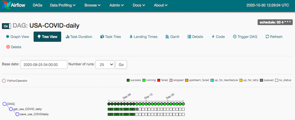

# US states COVID-19 cases & deaths

### Descriptions

This is my demo which utilizes microservices components to process and display COVID-19 data retrieved from disease.sh API.

In this demo, I attempt to put together 3 big technology stacks to build this Realtime Web-application. The 3 tech stacks are Airflow, Django and ReactJs.

### Architecture Diagram


### Services setups
```bash
services:
    backend:
        build: ./backend
        command: python manage.py runserver 0.0.0.0:8000
        volumes:
          - ./backend:/app
        ports:
          - "8000:8000"

    frontend:
        build: ./frontend
        volumes:
          - ./frontend:/app
          - '/app/node_modules'
        ports:
          - "3000:3000"
        environment:
          - CHOKIDAR_USEPOLLING=true
        depends_on:
            - backend

    scheduler:
        image: puckel/docker-airflow:1.10.9
        restart: always
        environment:
            - LOAD_EX=n
            - EXECUTOR=Local
        logging:
            options:
                max-size: 10m
                max-file: "3"
        volumes:
            - ./scheduler/dags:/usr/local/airflow/dags
            # - ./plugins:/usr/local/airflow/plugins
        ports:
            - "8080:8080"
        depends_on:
            - backend

```

### Quickstart
```bash
# create node_modules for frontend
cd frontend && npm install && cd ..
# launch pipeline
docker-compose up
```
To check frontend on your browser:

http://localhost:3000

### Turn on the ETL pipeline



Go to http://localhost:8080 It will direct you to Apache Airflow scheduler. Toggle both allStates-daily and usa-daily to ON. I will bring data to the postgres db.

### Apache Airflow as scheduler

Instead of coming up with my own solution for a scheduler, I utilize Apache Airflow. Its Pythonic and DAG design, plus UI interface which help to easily designing workflow and monitoring tasks.

### Django as backend

It has been a while since I used Django for my dev work. I can go with Flask for a simpler setups. However, I am trying to take advantages of Django's ORM, data model and it is known for the ability to scale better than Flask as the app grows.

### React as frontend

Finally, I chose React for my frontend framework. First, because of its popularity. Second, It is a Single-Page app (SPA). SPA provides speed performance since most resources are ONLY loaded once.
